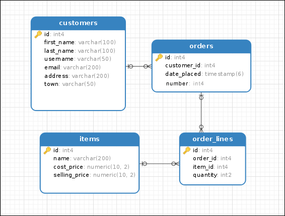

# SQLAlchemy CRUD-operations Example

(Python, [SQLAlchemy](https://www.sqlalchemy.org/), [SQLite](https://sqlite.org/index.html))

В проекте использовались материалы с сайта [PythonRu](https://pythonru.com/biblioteki/vvedenie-v-sqlalchemy)

Предполагается бизнес-задача по хранению информации о заказанных товарах, 
где "покупка" представляет из себя набор полей описывающих пользователя, товар и его количество.

Реализованы методы внесения, извлечения, изменения и удаления покупок. 

Взаимодействия с БД осуществляется через репозиторий. 
Реализовано два варианта: через SQLAlchemy CORE и SQLAlchemy ORM. 
В дальнейшем возможно добавление кэширования.

Для демонстрации применяется синтезирование данных.

ER-модель базы данных:

